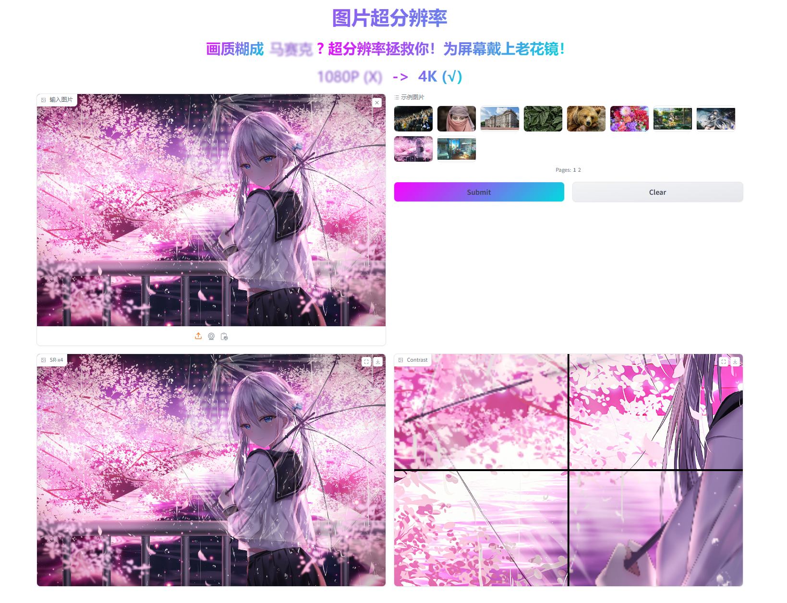
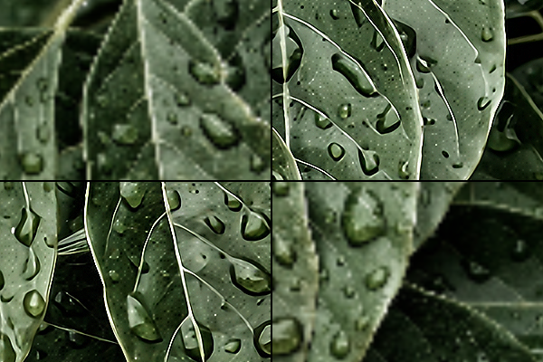
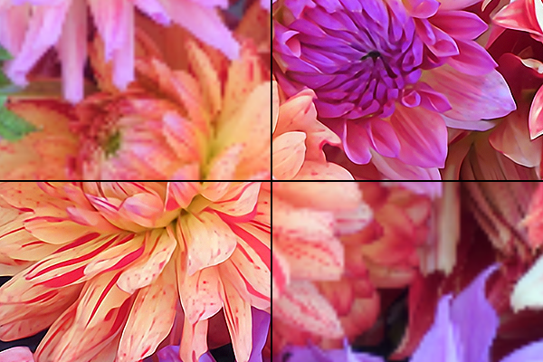
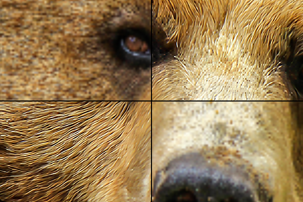
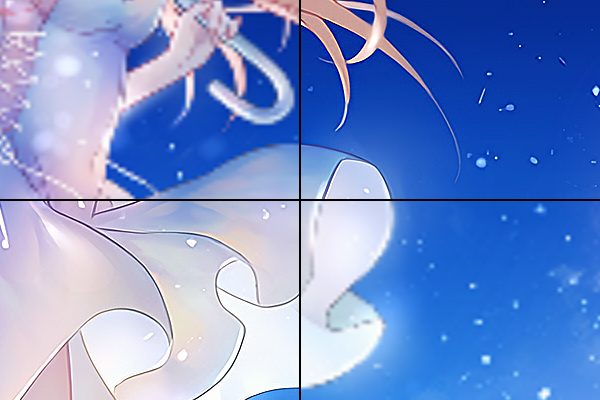

# RCAN 超分辨率项目

该项目实现了 Residual Channel Attention Network (RCAN)，用于图像超分辨率任务。RCAN 利用残差组（Residual Groups）和通道注意力机制（Channel Attention Mechanism），在保持图像细节的同时显著提升图像分辨率。

## 示例
### gradio展示


### 效果对比
左上和右下是原图 (LR)，右上和左下为超分后的图片 (SR)。
拼接时对原图进行了`cv2.resize()`对齐图片。
|  |  |
|------------------------|------------------------|
|  |  |

## 目录
- [项目简介](#项目简介)
- [依赖项](#依赖项)
- [安装](#安装)
- [使用方法](#使用方法)
- [训练模型](#训练模型)
  - [数据集构建](#数据集构建)
  - [开始训练](#开始训练)

## 项目简介

RCAN（Residual Channel Attention Network）是一种用于超分辨率任务的深度神经网络模型。其核心思想是通过残差学习和通道注意力机制，增强网络对细节的处理能力，从而在放大低分辨率图像时保留更多的细节信息。

该项目实现了 RCAN 模型的单张图像超分辨率处理，支持四倍倍率 (x4) 分辨率提升。

## 依赖项

参考项目环境：

- Python 3.9
- PyTorch 2.4.0

使用以下命令安装所需的 Python 包：

```bash
pip install -r requirements.txt
```

## 安装

克隆本项目

```bash
git clone https://github.com/your_username/RCAN-Super-Resolution.git
cd SR-RCAN
```

## 使用方法

通过以下命令，您可以轻松对图像进行超分辨率处理（`test.sh`）：

```bash
# 批量处理多张图片
python test/experiment.py --gpu_id 0 --pretrain experiment/RCAN/model/model_best.pth

# 处理单张图片
python test/experiment.py --gpu_id 0 --img_path data/0970x4.png --pretrain experiment/RCAN/model/model_best.pth

# 使用 Gradio 可视化界面
python test/experiment_gradio.py --gpu_id 0 --pretrain experiment/RCAN/model/model_best.pth

```

- --image_path 输入低分辨率图像的路径。
- --pre_train RCAN权重路径

要批量处理多张图片，请将它们放置在 `test/test_picture` 文件夹下，处理后的超分辨率图片会自动保存到 `test/sr_picture` 文件夹。
同时，系统会对超分结果进行锐化处理 (sharp 后缀的图片)，进一步提升视觉感知效果。

## 训练模型

### 数据集构建
代码使用了自建数据集, 由 [DIV2K](https://data.vision.ee.ethz.ch/cvl/DIV2K/) 数据集、200对动漫图片、200对人脸图片构成。  
如若你希望构建正确的数据集, 请将图片放至相应的文件夹：

- dataset/HR_train
- dataset/LR_train/x4
- dataset/HR_test
- dataset/LR_test/x4


### 开始训练
如果您想重新训练 RCAN 模型，使用以下命令 `train.sh`：
```bash
LOG="experiment/RCAN`date +%Y-%m-%d-%H-%M-%S`.out"

# 从0开始
nohup python main.py --save RCAN --gpu_id 0 --batch_size 32 --repeat 40 > $LOG &

# 加载已有权重
nohup python main.py --save RCAN --pre_train experiment/RCAN/model/model_best.pth --gpu_id 0 --batch_size 32 --repeat 40 > $LOG &

# 断点恢复
nohup python main.py --save RCAN --load RCAN --gpu_id 0 --batch_size 32 --repeat 40 > $LOG &
```

- --save 保存文件夹名
- --pretrain 加载模型路径
- --load 断点恢复, 文件夹名


